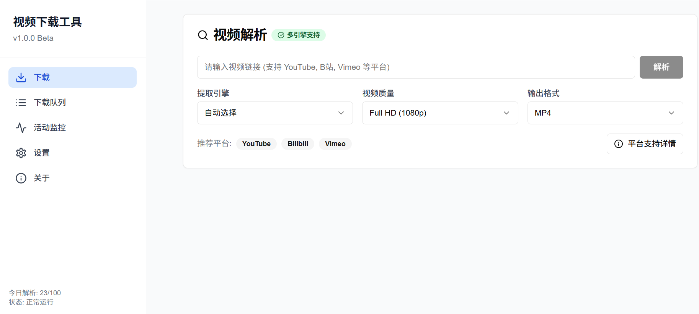
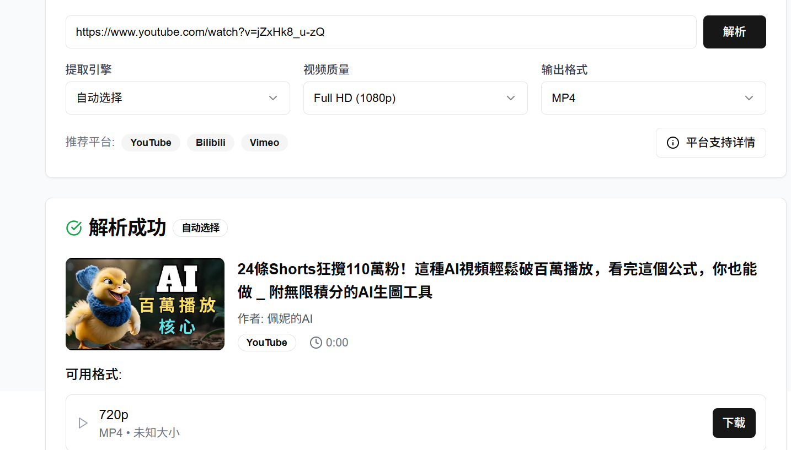
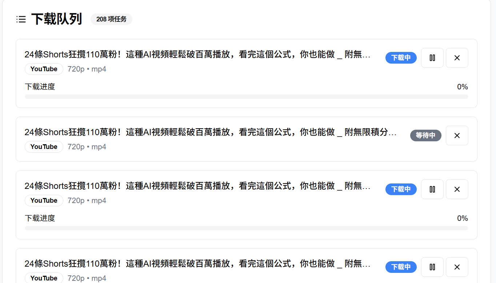
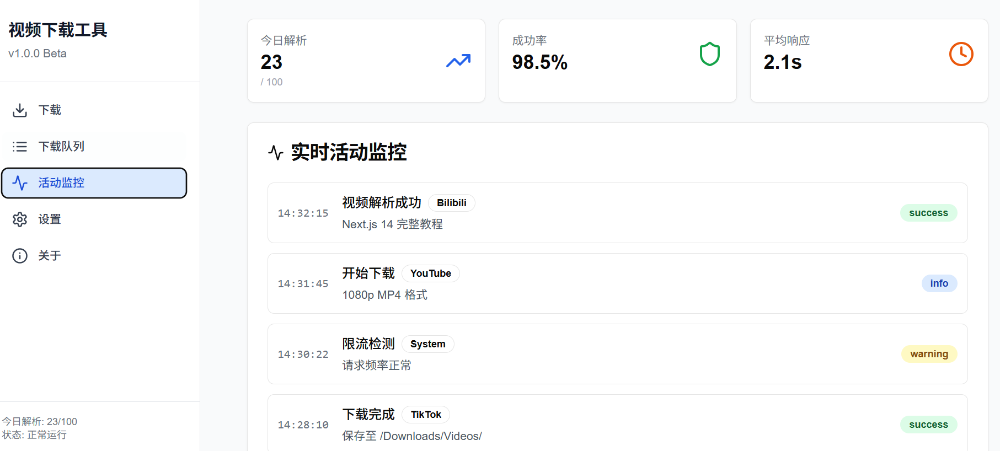
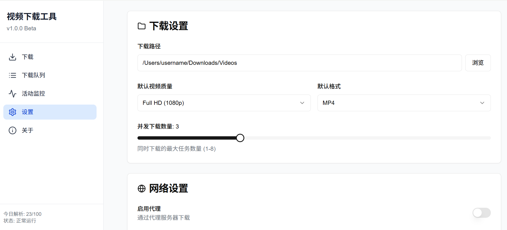

# 🎬 视频下载工具 (Video Downloader Pro)

一个现代化的跨平台视频下载工具，支持多个主流视频平台，提供简洁易用的界面和强大的下载功能。

体验地址：xzsp.netlify.app
## ✨ 功能特性

### 🎯 核心功能
- **多平台支持** - 支持 YouTube、Bilibili、Vimeo 等主流平台
- **多引擎架构** - 集成 yt-dlp、Cobalt、gallery-dl 等多个提取引擎
- **智能解析** - 自动选择最佳提取引擎，确保高成功率
- **多格式下载** - 支持 MP4、MKV、WebM、MP3、M4A 等多种格式
- **质量选择** - 从 4K 到标清，满足不同需求
- **批量下载** - 支持队列管理和批量操作

### 🛡️ 安全特性
- **客户端运行** - 无需服务器，保护隐私安全
- **证书锁定** - 防止中间人攻击
- **沙箱模式** - 限制文件系统访问权限
- **防滥用机制** - 智能限流，遵守平台规则

### 🎨 用户体验
- **现代化界面** - 基于 React + Tailwind CSS 的美观界面
- **响应式设计** - 适配各种屏幕尺寸
- **实时进度** - 详细的下载进度和状态显示
- **智能提示** - 友好的错误提示和使用建议

## 🖼️ 界面截图

### 主界面

### 视频解析

### 下载队列

### 活动监控

### 设置页面

## 🚀 快速开始

### 环境要求
- Node.js 18.0 或更高版本
- npm 或 yarn 包管理器
- 现代浏览器（Chrome、Firefox、Safari、Edge）

### 安装步骤

1. **克隆项目**
   \`\`\`bash
   git clone https://github.com/your-username/video-downloader-pro.git
   cd video-downloader-pro
   \`\`\`

2. **安装依赖**
   \`\`\`bash
   npm install
   # 或使用 yarn
   yarn install
   \`\`\`

3. **启动开发服务器**
   \`\`\`bash
   npm run dev
   # 或使用 yarn
   yarn dev
   \`\`\`

4. **访问应用**
   打开浏览器访问 \`http://localhost:3000\`

### 生产部署

1. **构建项目**
   \`\`\`bash
   npm run build
   \`\`\`

2. **启动生产服务器**
   \`\`\`bash
   npm start
   \`\`\`

## 📱 平台支持

| 平台 | 支持状态 | 说明 |
|------|----------|------|
| 🎥 YouTube | ✅ 完全支持 | 支持各种质量和格式，包括播放列表 |
| 📺 Bilibili | ✅ 完全支持 | 支持大部分视频，可能需要处理分P视频 |
| 🎬 Vimeo | ✅ 完全支持 | 支持公开视频，私有视频需要权限 |
| 🐦 Twitter/X | ⚠️ 部分支持 | 支持部分视频，可能受到API限制 |
| 📷 Instagram | ⚠️ 部分支持 | 支持公开视频，私有账户需要登录 |
| 🎵 抖音/TikTok | ❌ 受限支持 | 技术限制：动态URL、防盗链、地区限制 |
| 📱 快手 | ❌ 受限支持 | 技术限制：加密URL、需要特殊解析 |

### 受限平台说明

**抖音、快手等短视频平台**由于以下技术限制暂不支持：
- 动态URL：视频链接经常变化
- 防盗链机制：平台主动阻止第三方下载
- 加密保护：视频URL经过加密处理
- 地区限制：某些内容仅在特定地区可用

**替代方案：**
- 使用官方应用的内置下载功能
- 尝试屏幕录制工具
- 联系内容创作者获取原始文件

## 🛠️ 技术栈

### 前端技术
- **React 18** - 用户界面框架
- **Next.js 14** - 全栈 React 框架
- **TypeScript** - 类型安全的 JavaScript
- **Tailwind CSS** - 实用优先的 CSS 框架
- **shadcn/ui** - 现代化 UI 组件库

### 后端技术
- **Node.js** - 服务器运行时
- **Next.js API Routes** - API 接口
- **yt-dlp** - 视频提取引擎
- **Cobalt** - 现代化下载 API
- **gallery-dl** - 媒体下载工具

### 开发工具
- **ESLint** - 代码质量检查
- **Prettier** - 代码格式化
- **Husky** - Git 钩子管理

## 📖 使用指南

### 基本使用

1. **输入视频链接**
   - 在主界面的输入框中粘贴视频链接
   - 支持的格式：完整URL或短链接

2. **选择下载选项**
   - **提取引擎**：选择合适的提取引擎（推荐自动选择）
   - **视频质量**：从4K到标清，根据需要选择
   - **输出格式**：MP4、MKV、WebM等视频格式，或MP3、M4A音频格式

3. **解析视频**
   - 点击"解析"按钮开始分析视频
   - 系统会自动获取视频信息和可用格式

4. **开始下载**
   - 选择合适的格式和质量
   - 点击"下载"按钮开始下载
   - 在"下载队列"标签页查看进度

### 高级功能

#### 批量下载
1. 在"下载队列"页面管理多个下载任务
2. 支持暂停、恢复、取消操作
3. 实时显示下载进度和速度

#### 设置配置
1. 访问"设置"页面自定义配置
2. 调整下载路径、并发数量等参数
3. 配置网络代理和安全选项

#### 活动监控
1. 在"活动监控"页面查看系统状态
2. 监控解析成功率和系统性能
3. 查看详细的操作日志

## ⚠️ 重要声明

### 法律声明
- 本工具仅用于**合法授权**的视频内容下载
- 使用者应确保已获得**版权方授权**
- 请遵守各平台的**服务条款**和使用协议
- 禁止用于**商业用途**或侵犯他人版权
- 连续24小时内解析请求超过100次将自动触发限流机制

### 免责声明
- 开发者不承担因违规使用而产生的任何法律责任
- 用户应自行承担使用本工具的风险
- 本工具不保证100%的成功率和稳定性

## 🤝 贡献指南

我们欢迎社区贡献！请遵循以下步骤：

### 报告问题
1. 在 [Issues](https://github.com/your-username/video-downloader-pro/issues) 页面创建新问题
2. 详细描述问题和复现步骤
3. 提供相关的错误信息和截图

### 提交代码
1. Fork 本项目
2. 创建功能分支：\`git checkout -b feature/new-feature\`
3. 提交更改：\`git commit -m 'Add new feature'\`
4. 推送分支：\`git push origin feature/new-feature\`
5. 创建 Pull Request

### 开发规范
- 遵循 ESLint 和 Prettier 配置
- 编写清晰的提交信息
- 添加必要的测试用例
- 更新相关文档

## 📋 开发计划

### 近期计划 (v1.1)
- [ ] 添加更多视频平台支持
- [ ] 实现字幕下载功能
- [ ] 优化下载性能
- [ ] 添加视频预览功能

### 中期计划 (v1.2)
- [ ] 集成 Electron 桌面应用
- [ ] 实现浏览器扩展
- [ ] 添加云存储集成
- [ ] 支持直播录制

### 长期计划 (v2.0)
- [ ] AI 智能推荐
- [ ] 多语言支持
- [ ] 移动端应用
- [ ] 企业版功能

## 📞 支持与反馈

- **GitHub Issues**: [提交问题](https://github.com/your-username/video-downloader-pro/issues)
- **讨论区**: [GitHub Discussions](https://github.com/your-username/video-downloader-pro/discussions)
- **邮箱**: support@videodownloader.pro
- **QQ群**: 123456789

## 📄 许可证

本项目基于 [MIT License](LICENSE) 开源协议发布。

## 🙏 致谢

感谢以下开源项目的支持：
- [yt-dlp](https://github.com/yt-dlp/yt-dlp) - 强大的视频下载工具
- [Next.js](https://nextjs.org/) - React 全栈框架
- [Tailwind CSS](https://tailwindcss.com/) - CSS 框架
- [shadcn/ui](https://ui.shadcn.com/) - UI 组件库

## 📊 项目统计

---

**⭐ 如果这个项目对您有帮助，请给我们一个 Star！**
